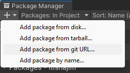
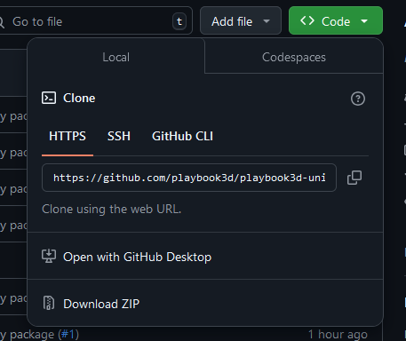
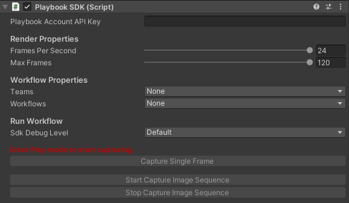
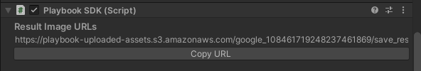

Playbook's Unity SDK integrates the editor with ComfyUI. It allows you to quickly create and refine textures for your
scene using generative diffusion models.

[Get the Unity SDK](https://github.com/playbook3d/playbook3d-unity-sdk)

## Adding Playbook To Your Project

<Warning>
  The Unity SDK only works on projects that are using the Universal Render
  Pipeline. If your project is not using URP, you can add it by following this
  guide: [Installing URP into an existing
  Project](https://docs.unity3d.com/Packages/com.unity.render-pipelines.universal@7.1/manual/InstallURPIntoAProject.html)
</Warning>

<Steps>
    <Step title="Open up the Package Manager">
        Once you have your Unity project open, go to Window -> Package Manager. In the package manager, click the plus 
        icon on the top left and click "Add package from git URL...".
        <Frame></Frame>
    </Step>

    <Step title="Add the package through Github">
        Enter the link provided by our repository: [Unity SDK](https://github.com/playbook3d/playbook3d-unity-sdk)

        <Frame></Frame>
    </Step>

    <Step title="Add the dependency">
        Playbook is dependent on `SocketIOUnity`, so make sure to also add it to your project using the same steps as
        before: [Socket IO Unity](https://github.com/itisnajim/SocketIOUnity)
    </Step>

</Steps>

## How To Use Playbook

<Steps>
    <Step title="Attach the PlaybookSDK component">
        To begin using Playbook, simply attach the `PlaybookSDK` component to your main camera.

        <Frame>
            
        </Frame>
    </Step>

    <Step title="Add your API key">
        Add your Playbook API key in the `Playbook Account API Key` field. You can grab your API key from your
        [Playbook](https://beta.playbook3d.com/) account.
    </Step>

    <Step title="Select your team + workflow">
        Once you enter Play mode in Unity, the `Teams` and `Workflows` properties will be populated with your respective
        teams and workflows. Select the ones you want to work with.
    </Step>

    <Step title="Start capturing">
        You can now start capturing a single frame or an image sequence by clicking the buttons.
    </Step>

    <Step title="Wait for the render">
        Once the render is complete, you'll find the URL to your image in the `PlaybookSDK` component. Copy this link,
        paste it on your local internet browser, and your image will start downloading.

        <Frame></Frame>
    </Step>

</Steps>

## The Mask Pass

You can further customize your renders by manipulating the mask pass.
To add or remove GameObjects from mask groups, you can call the following methods:

<Warning>
  GameObjects that do not have a `Renderer` component attached cannot be added
  to a mask group.
</Warning>

```cs

// To add
PlaybookSDK.AddObjectToMaskGroup(GameObject maskObject, MaskGroup maskGroup);
PlaybookSDK.AddObjectsToMaskGroup(List<GameObject> maskObjects, MaskGroup maskGroup);

// To remove
PlaybookSDK.RemoveObjectFromMaskGroup(GameObject maskObject);
PlaybookSDK.RemoveObjectsFromMaskGroup(List<GameObject> maskObjects);

```

Additionally, you can also change the mask group of the background through these methods:

```cs

// To add
PlaybookSDK.SetBackgroundMaskGroup(MaskGroup maskGroup);

// To remove
PlaybookSDK.RemoveBackgroundMaskGroup();

```

<Note>
  Playbook supports up to 7 mask groups which are specified by the `MaskGroup`
  property. `MaskGroup` also includes the "Catch-all" mask, which is the default
  group for objects that are not part of a mask group.
</Note>

## Overriding Node Inputs

If you would like to manually override node inputs, you can do so by using `OverrideNodeInputs()`
given in `PlaybookNetwork.cs`.

To call `OverrideNodeInputs()`, you must provide at least 3 parameters:

1. The input dictionary as a reference
   - The dictionary will already be provided to you in `RunWorkflow()`
2. The ID of the node you would like to override
3. The new value of the given node
4. (Optional) Any trigger words to pass into the given node

```cs
OverrideNodeInputs(ref inputs, nodeId: "4", value: "Hello World!");
```

This method should be called before inputs are passed in as `RunWorkflowProperties` in `RunWorkflow()`

```cs
private IEnumerator RunWorkflow(string accessToken)
{
    string url = $"{_apiBaseURL}{RunWorkflowEndpoint}{GetCurrentSelectedWorkflow().team_id}";

    Dictionary<string, object> inputs = new();

    // Add any overrides here
    OverrideNodeInputs(ref inputs, "4", "Hello World!");

    RunWorkflowProperties data =
        new()
        {
            id = GetCurrentSelectedWorkflow().id,
            origin = "2",
            inputs = inputs,
        };

    ...
}
```
