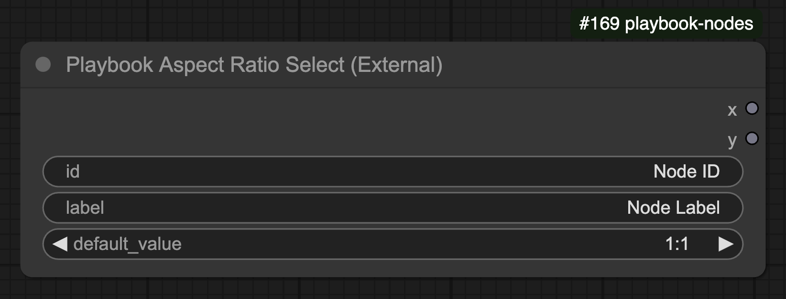

## Overview

The **Playbook Aspect Ratio Select** node allows users to select a predefined aspect ratio for rendering operations.

## 🛠️ Node Configuration

### **Inputs**
| Name         | Type   | Required | Default  | Description |
|-------------|--------|----------|----------|--------------------------------|
| `id`        | STRING | ✅        | "Node ID" | Unique identifier for the node. |
| `label`     | STRING | ✅        | "Node Label" | Label for the node. |
| `default_value` | ENUM   | ✅    | `"1:1"` | The default aspect ratio from the available options. |

### **Outputs**
| Name   | Type   | Description |
|--------|--------|--------------------------------|
| `x`    | INT    | The width component of the selected aspect ratio. |
| `y`    | INT    | The height component of the selected aspect ratio. |

## 📏 Available Aspect Ratios
- **1:1** (Square)
- **16:9** (Widescreen)
- **9:16** (Portrait)
- **4:3** (Standard TV)
- **3:4** (Portrait Mode)

## ⚙️ Functionality

- Allows users to select an aspect ratio from a predefined list.
- Maps each selected aspect ratio to its respective width (`x`) and height (`y`) values.
