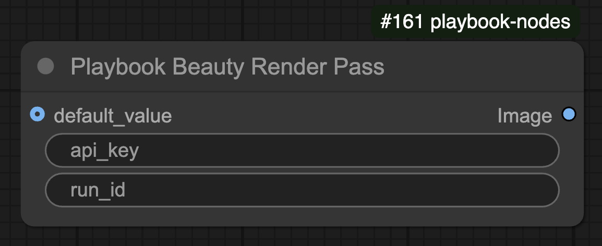
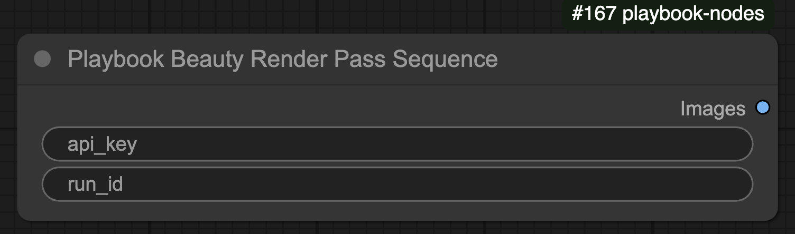

# Playbook Beauty Pass Node

The **Playbook Beauty Pass** node retrieves a **single Beauty Render Pass frame** from Playbook3D. It fetches a high-quality beauty render for visualization and processing.

## 🛠️ Node Configuration

### **Inputs**
| Name         | Type   | Required | Default | Description |
|-------------|--------|----------|---------|--------------------------------|
| `api_key`   | STRING | ✅        | N/A     | API key for authentication. |
| `run_id`    | STRING | ❌        | N/A     | Optional identifier for a specific run. |
| `default_value` | IMAGE | ❌        | N/A     | Default image if no valid render is found. |

### **Outputs**
| Name     | Type   | Description |
|----------|--------|--------------------------------|
| `Image`  | IMAGE  | The retrieved Beauty Render Pass image. |

## ⚙️ Functionality

- Uses `api_key` to authenticate with Playbook3D.
- If `run_id` is provided, fetches the Beauty Pass for that specific render.
- If no valid render is found, returns the **default image**.
- Converts the retrieved image to an RGB tensor format.

# Playbook Beauty Pass Sequence node

The **Playbook Beauty Pass Sequence** node retrieves a **sequence of Beauty Render Pass frames** from Playbook3D. It fetches a series of images stored in a ZIP file and returns them as a batch.

## 🛠️ Node Configuration

### **Inputs**
| Name         | Type   | Required | Default | Description |
|-------------|--------|----------|---------|--------------------------------|
| `api_key`   | STRING | ✅        | N/A     | API key for authentication. |
| `run_id`    | STRING | ❌        | N/A     | Optional identifier for a specific run. |

### **Outputs**
| Name     | Type   | Description |
|----------|--------|--------------------------------|
| `Images` | IMAGE  | A batch tensor containing extracted Beauty Pass frames. |

## ⚙️ Functionality

- Uses `api_key` to authenticate with Playbook3D.
- Retrieves a ZIP file containing multiple **Beauty Pass frames**.
- Extracts and converts the images into a batch tensor format.
- Processes and normalizes the images before returning them.
