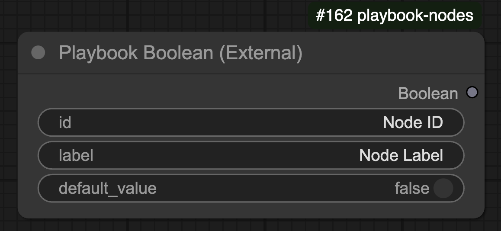

## Overview

The **Playbook Boolean** node allows users to define a boolean value (`True` or `False`) for use in Playbook3D workflows.

## 🛠️ Node Configuration

### **Inputs**
| Name         | Type    | Required | Default   | Description |
|-------------|---------|----------|-----------|--------------------------------|
| `id`        | STRING  | ✅        | "Node ID" | Unique identifier for the node. |
| `label`     | STRING  | ✅        | "Node Label" | Label for the node. |
| `default_value` | BOOLEAN | ✅ | `False` | Default boolean value. |

### **Outputs**
| Name    | Type    | Description |
|---------|---------|--------------------------------|
| `Boolean` | BOOLEAN | The resulting boolean value. |

## ⚙️ Functionality

- The node provides a **boolean toggle** (`True` or `False`).
- The output defaults to `False` unless overridden by user input.
