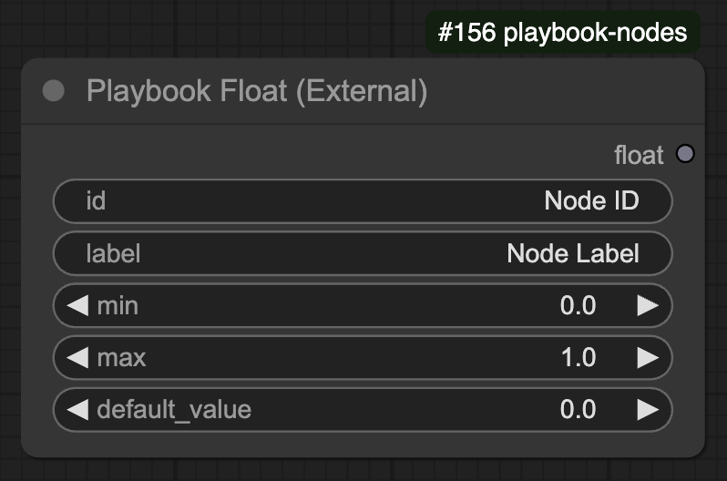

## Overview

The **Playbook Float** node allows users to define a numeric float input constrained by a minimum and maximum value.

## 🛠️ Node Configuration

### **Inputs**
| Name         | Type    | Required | Default  | Description |
|-------------|---------|----------|----------|--------------------------------|
| `id`        | STRING  | ✅        | "Node ID" | Unique identifier for the node. |
| `label`     | STRING  | ✅        | "Node Label" | Label for the node. |
| `min`       | FLOAT   | ✅        | `0.0`    | Minimum value allowed. |
| `max`       | FLOAT   | ✅        | `1.0`    | Maximum value allowed. |
| `default_value` | FLOAT | ❌      | `0.0`    | Default float value within range. |

### **Outputs**
| Name  | Type  | Description |
|-------|------|--------------------------------|
| `float` | FLOAT | The generated float value. |

## ⚙️ Functionality

- Ensures the float output is always within the range `[min, max]`.
- Uses **`np.clip`** to enforce value constraints.
- If `id` is not numeric, it falls back to `default_value`.
