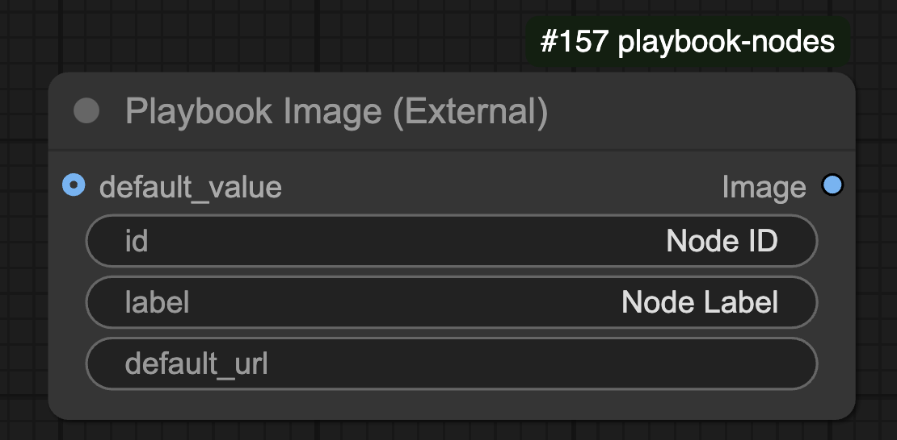

## Overview

The **Playbook Image** node allows users to load an image either from a provided URL or from a default image input.

## 🛠️ Node Configuration

### **Inputs**
| Name          | Type    | Required | Default  | Description |
|--------------|--------|----------|----------|--------------------------------|
| `id`        | STRING | ✅        | "Node ID" | Unique identifier for the node. |
| `label`     | STRING | ✅        | "Node Label" | Label for the node. |
| `default_url` | STRING | ❌        | `""`      | URL of the image to load. |
| `default_value` | IMAGE  | ❌        | `None`    | Default image input if URL is not provided. |

### **Outputs**
| Name    | Type  | Description |
|---------|------|--------------------------------|
| `Image` | IMAGE | The loaded image. |

## ⚙️ Functionality

- If `default_url` is provided, the node attempts to fetch and load the image.
- If no valid URL is available, it falls back to `default_value`.
- Converts the retrieved image to an RGB tensor format.
