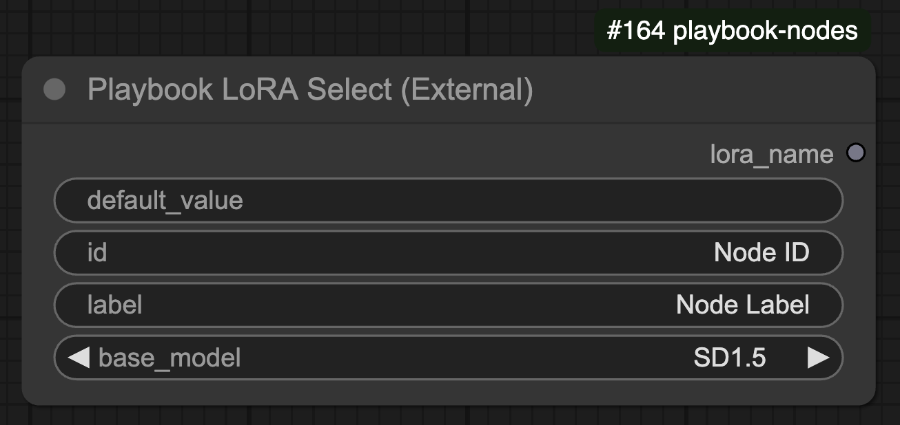

## Overview

The **Playbook LoRA Selection** node enables users to dynamically select a **LoRA model** for different base models such as Stable Diffusion 1.5, SDXL, CogVideoX, and Flux.

## 🛠️ Node Configuration

### **Inputs**
| Name         | Type    | Required | Default  | Description |
|-------------|---------|----------|----------|--------------------------------|
| `default_value` | STRING  | ✅        | `""`      | Name of the LoRA model. |
| `id`        | STRING  | ✅        | "Node ID" | Unique identifier for the node. |
| `label`     | STRING  | ✅        | "Node Label" | Label for the node. |
| `base_model` | ENUM    | ✅        | `"SD1.5"` | Base model for which the LoRA is intended. |

### **Available Base Models**
- **SD1.5** (Stable Diffusion 1.5)
- **SDXL** (Stable Diffusion XL)
- **CogVideoX** (AI video generation model)
- **Flux** (Advanced diffusion model)

### **Outputs**
| Name      | Type   | Description |
|-----------|--------|--------------------------------|
| `lora_name` | STRING | The selected LoRA model name. |

## ⚙️ Functionality

- Users can **select a LoRA model** for different base models.
- The selected LoRA model is returned as a string for further processing.
