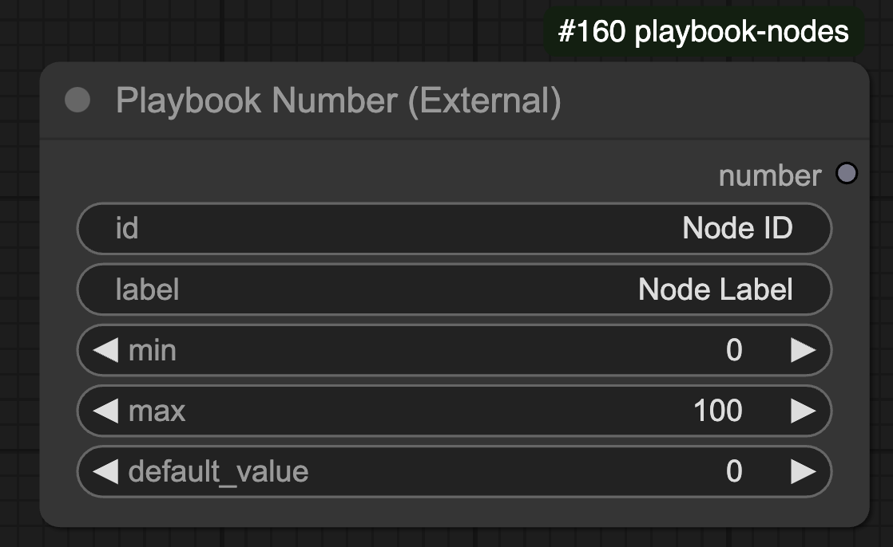

## Overview

The **Playbook Number** node in ComfyUI allows users to define a numeric input constrained by a minimum and maximum value. It provides the ability to specify a default value and ensures the output remains within a valid range.

## 🛠️ Node Configuration

### **Inputs**
| Name            | Type    | Required | Default        | Description                          |
|----------------|--------|----------|----------------|--------------------------------------|
| `id`          | STRING | ✅        | "Node ID"      | Unique identifier for the node. |
| `label`       | STRING | ✅        | "Node Label"   | Label for the node. |
| `min`         | INT    | ✅        | `0`            | Minimum value the node can output. |
| `max`         | INT    | ✅        | `100`          | Maximum value the node can output. |
| `default_value` | INT    | ❌        | `0`            | Default value (optional). |

### **Outputs**
| Name     | Type  | Description                        |
|----------|------|------------------------------------|
| `number` | INT  | The generated integer output. |

## ⚙️ Functionality

- Ensures that the output is always within the range `[min, max]`.
- If `id` is **empty or not numeric**, it returns the `default_value` constrained within the min-max range.
- If `id` is provided and numeric, it is converted to an integer and clipped within the min-max range.
- Uses `np.clip` to maintain constraints.
