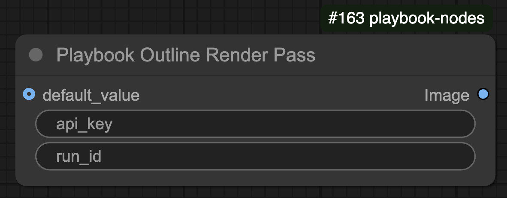
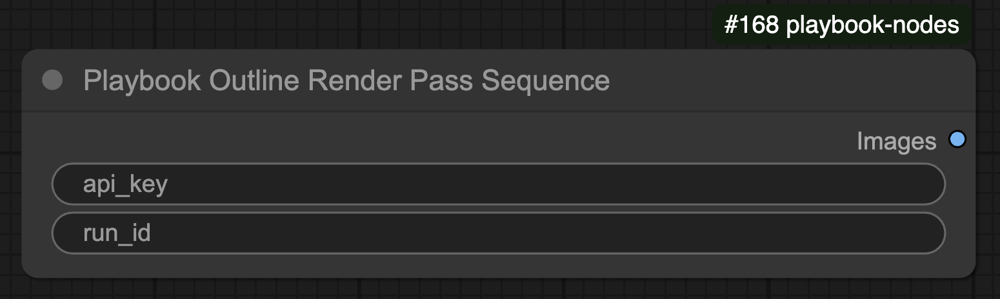

# Playbook Outline Pass Node

The **Playbook Outline Pass** node retrieves a **single Outline Render Pass frame** from Playbook3D. It provides edge-detection data for rendering workflows.

## 🛠️ Node Configuration

### **Inputs**
| Name         | Type   | Required | Default | Description |
|-------------|--------|----------|---------|--------------------------------|
| `api_key`   | STRING | ✅        | N/A     | API key for authentication. |
| `run_id`    | STRING | ❌        | N/A     | Optional identifier for a specific run. |
| `default_value` | IMAGE | ❌        | N/A     | Default image if no valid render is found. |

### **Outputs**
| Name     | Type   | Description |
|----------|--------|--------------------------------|
| `Image`  | IMAGE  | The retrieved Outline Render Pass image. |

## ⚙️ Functionality

- Uses `api_key` to authenticate with Playbook3D.
- If `run_id` is provided, fetches the Outline Pass for that specific render.
- If no valid render is found, returns the **default image**.
- Converts the retrieved image to an RGB tensor format.

# Playbook Outline Pass Sequence Node

The **Playbook Outline Pass Sequence** node retrieves a **sequence of Outline Render Pass frames** from Playbook3D. It fetches a ZIP file containing multiple outline images and processes them as a batch.

## 🛠️ Node Configuration

### **Inputs**
| Name         | Type   | Required | Default | Description |
|-------------|--------|----------|---------|--------------------------------|
| `api_key`   | STRING | ✅        | N/A     | API key for authentication. |
| `run_id`    | STRING | ❌        | N/A     | Optional identifier for a specific run. |

### **Outputs**
| Name     | Type   | Description |
|----------|--------|--------------------------------|
| `Images` | IMAGE  | A batch tensor containing extracted Outline Pass frames. |

## ⚙️ Functionality

- Uses `api_key` to authenticate with Playbook3D.
- Retrieves a ZIP file containing multiple **Outline Pass frames**.
- Extracts and converts the images into a batch tensor format.
- Processes and normalizes the images before returning them.
