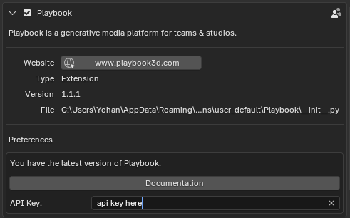
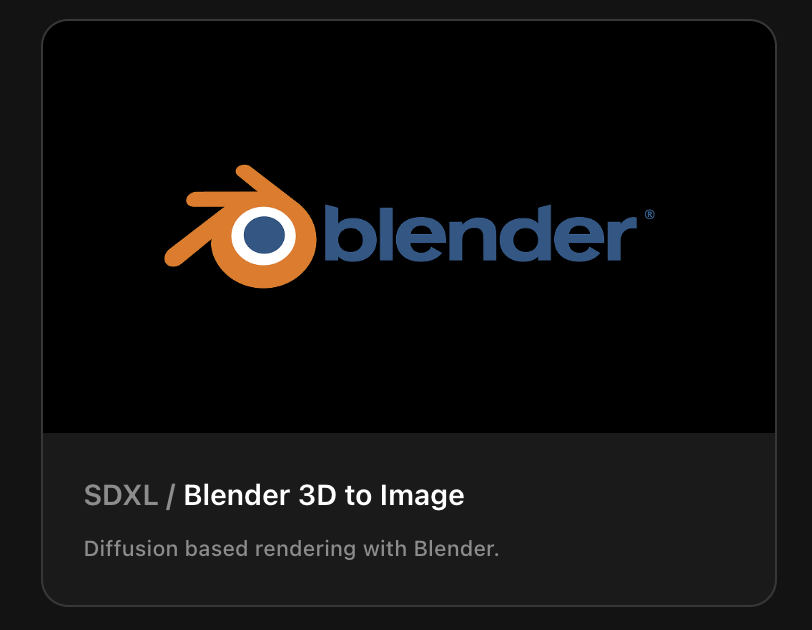
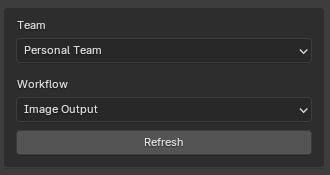
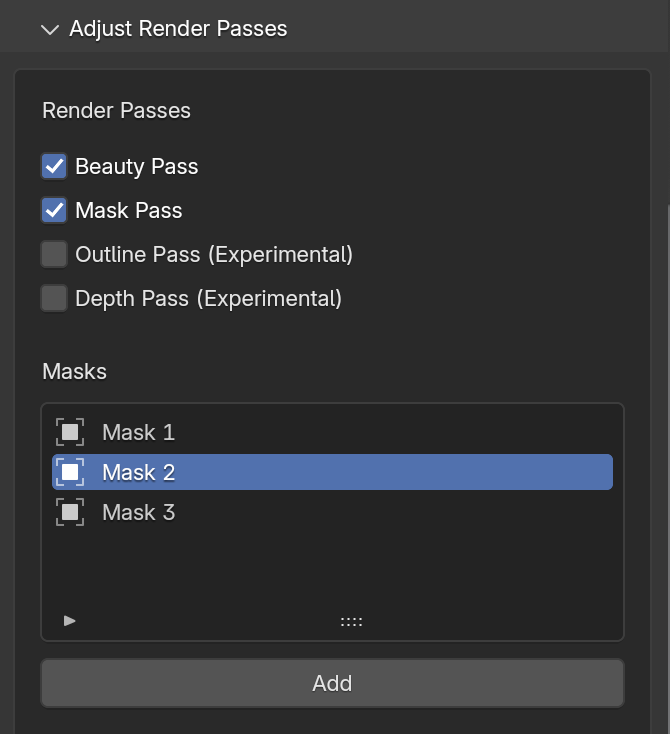
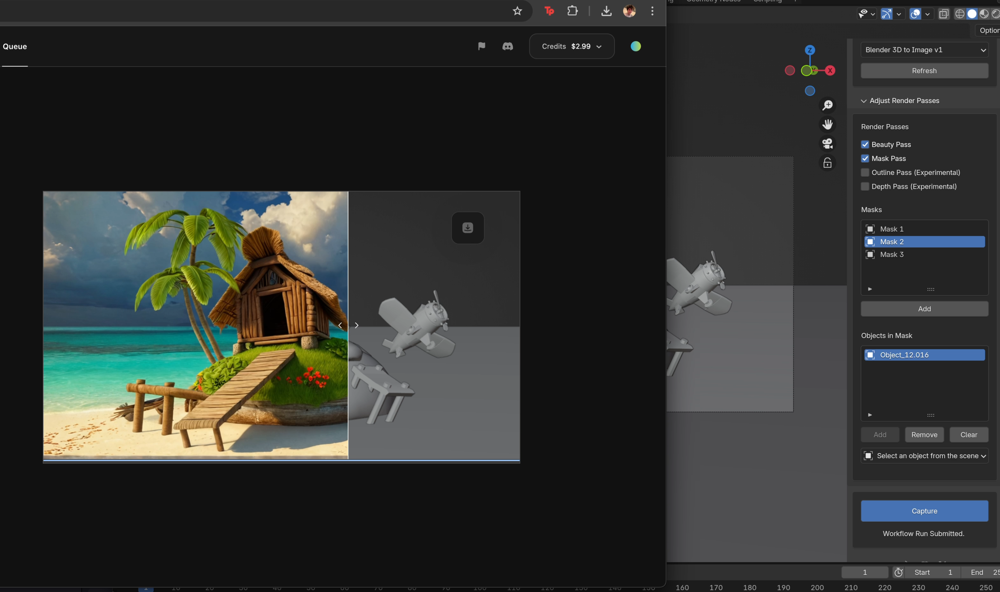
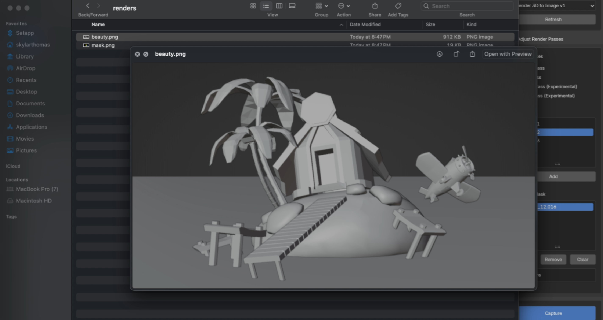

<Info>Works out of the box with **Blender 4.2 LTS+**</Info>

<iframe width="560" height="315" src="https://www.youtube.com/embed/8rDd1vPnn4I?si=5KSh_Q3G-w0l-t7L" title="YouTube video player" frameborder="0" allow="accelerometer; autoplay; clipboard-write; encrypted-media; gyroscope; picture-in-picture; web-share" referrerpolicy="strict-origin-when-cross-origin" allowfullscreen></iframe>

## Installation

<Steps>
  <Step title="Download from Gumroad">
    👉 [Download from Gumroad](https://playbook3d.gumroad.com/l/kwfam)
  </Step>

  <Step title="Install add-on">
    Click **`Edit`**, then `Preferences`

    Click **`Install`**, then upload the **.zip file, and enable the checkbox**

{" "}

  </Step>

  <Step title="Copy & Paste your API key">
    Grab your API key from your [beta.playbook3d.com](https://beta.playbook3d.com/) account

    Paste it into the Add-on settings&#x20;

    <Frame></Frame>

  </Step>
</Steps>

## Usage

<Steps>
  <Step title="Click N to bring up the plugin.">
    In the viewport, **click N** and select Playbook from the right side tab.
  </Step> 
  <Step title="Clone the Blender template workflow.">
    Head over to [beta.playbook3d.com](https://beta.playbook3d.com/) and clone the template SDXL workflow for Blender.
    
    <Frame height="200"></Frame>
  </Step> 
  <Step title="Select your team and workflow.">
    Select your desired Playbook team and the workflow you'd like to run with Blender.

    <Frame></Frame>
  </Step>
  <Step title="Configure render settings.">
    Enable your desired render passes. The add-on supports a total of 4 masks - 3 assigned, the 4th being a catch all. **Note that Depth and Outline passes are experimental and will work better in uncontained, outdoor scenes.**
    
    <Tip>**View -> Align View -> Align Active Camera to View** to capture from active camera.</Tip>

    <Frame></Frame>
  </Step>
  <Step title="Run workflow in the cloud.">
    Enter your desired prompts per each mask in the Playbook editor. Click "Capture" from Blender to initiate a workflow run using the streamed render passes. **Note that no generations will occur if the editor is not up.**
    
    <Frame></Frame>
  </Step>
  <Step title="Optional: Access local render passes.">
    <Note>Access locally saved passes at **/Users/** Your Username **/Library/Application Support/Blender/4.2/extensions/user_default/Playbook/renders**</Note>
    <Frame></Frame>
  </Step>
</Steps>