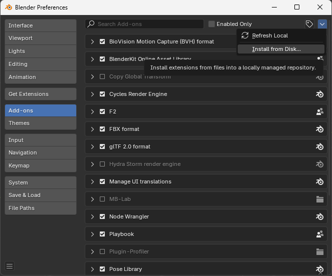

Playbook's Blender Add-on integrates the editor with ComfyUI. It allows you to quickly create and refine textures for your scene using generative diffusion models.

## Features:

- [ ] Single point-of-view texture projection

- [ ] Multiple point-of-view texture projection (WIP)

- [x] Perspective camera

- [x] Orthographic camera

- [x] Image to image

- [x] Remote ComfyUI instance support

- [ ] Batch rendering (WIP)

## Installation Guide

<Info>Works out of the box with **Blender 4.2 LTS+**</Info>

<Steps>
  <Step title="Download from Gumroad">
    👉 [Download from Gumroad](https://playbook3d.gumroad.com/l/kwfam)
  </Step>

  <Step title="Install add-on">
    Click **`Edit`**, then `Preferences`

    Click **`Install`**, then upload the **.zip file, and enable the checkbox**

{" "}

<Frame></Frame>

  </Step>

  <Step title="Copy & Paste your API key">
    Grab your API key from your [beta.playbook3d.com](https://beta.playbook3d.com/) account

    Paste it into the Add-on settings&#x20;

    <Frame></Frame>

  </Step>
</Steps>

## How To Use The Add-on

### Select a workflow

To begin creating a new render, select your team and workflow through the dropdowns shown here:

<Frame></Frame>

If you have not yet created a workflow, click the "Open Dashboard" button and create a workflow there.

### Set your render settings

<Frame></Frame>

#### Render Passes

This is where you can choose what passes should be rendered when capturing.

Beauty Pass:

Mask Pass:

Normal Pass:

Outline Pass:

#### Masks

If you decide to render a mask pass, you can organize the objects in your scene by different masks. You can add a new mask by clicking the "Add" button.

You can then add an object to the selected mask in two ways:

- Select the desired object through the dropdown
- Select the object through the blender editor. The add-on will detect when an object was selected and the "Add" button will become available.

Playbook supports up to 7 masks.

### Run Your Workflows

You can now run your workflow!

Either capture a single frame by clicking "Single Image Capture" or capture a series of continuous frames by first clicking "Start Sequence Capture" and then clicking "End Sequence Capture" once you want your sequence to end.

<Frame></Frame>
